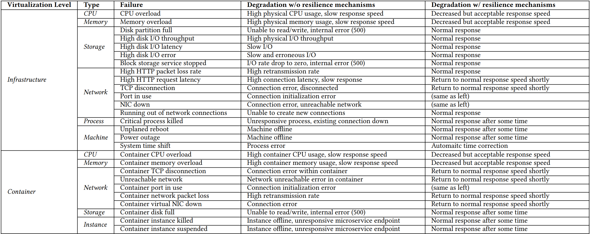
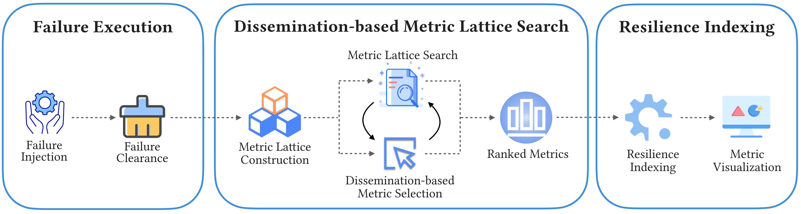
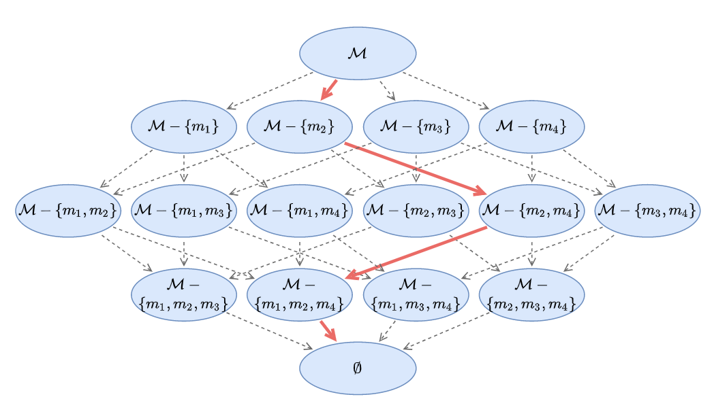

# MicroRes

This repository accompanies our ISSTA'24 paper "MicroRes: Versatile Resilience Profiling in Microservices via Degradation Dissemination Indexing".

* DOI: [10.1145/3650212.3652131](https://doi.org/10.1145/3650212.3652131)
* arXiv: [2212.12850](https://arxiv.org/abs/2212.12850)
* Dataset: [10.5281/zenodo.10846876](https://doi.org/10.5281/zenodo.10846876)
* GitHub: [MicroRes](https://github.com/yttty/MicroRes)

If you use our data or code, please kindly cite our paper.

```bibtex
@inproceedings{yang2024microres,
  title = {MicroRes: Versatile Resilience Profiling in Microservices via Degradation Dissemination Indexing},
  author = {Yang, Tianyi and Lee, Cheryl and Shen, Jiacheng and Su, Yuxin and Yang, Yongqiang and Lyu, Michael R},
  booktitle = {Proceedings of ACM SIGSOFT 33rd International Symposium on Software Testing and Analysis},
  year = {2024},
  url = {https://doi.org/10.1145/3650212.3652131}
}
```

## Methodology

### Motivating Examples
The following table shows the motivating examples of our comparison between resilient and unresilient deployments on Kubernetes.



### The Versatile Microserrvice Resilience Profiling Framework

We propose MicroRes, a versatile microservice resilience profiling framework via degradation dissemination indexing. The figure illustrates the overall workflow of MicroRes. It consists of three phases, i.e., failure execution, dissemination-based metric lattice search, and resilience indexing. The failure execution is composed of failure injection and failure clearance. Given a specified failure and a predefined load generator, MicroRes collects the to-be-tested service's monitoring metrics in the normal and faulty period. For the disseminationbased metric lattice search, we propose a dissemination-based metric selection algorithm. We organize all possible metric subsets of the monitoring metrics as a huge lattice. Then MicroRes searches the lattice while reducing the dimension by gradually selecting and removing the metric that contributes most to the overall degradation. In this way, the search path naturally forms a ranked list of monitoring metrics along with their contribution to the overall degradation. Lastly, for resilience indexing, we calculate the resilience index by how much the degradation disseminates from system performance metrics to user-aware metrics.



The following figure shows the metric lattice constructed by the metrics. The red arrow indicates the degradation-based metric selection process.



## Usage

### Prerequisites
- Python3.9.
- Install the requirements (by `pip install -r requirements.txt`).

### Steps to run
- The `MicroRes` class provides an interface for resilience evaluation. Here's the code sample:
    ```python
    from microres.core import MicroRes
    from microres.model.distance import Euclidean, ComplexityInvariantDistance, DTW
    microres = MicroRes(f_cont = ComplexityInvariantDistance.cid_distance) # select a contribution measure from microres/model/distance.py
    r = microres.eval(testId, metricMetadata, normalInterval, faultyInterval, metrics) # the resilience value
    ```
- The dataset pkl file ([https://doi.org/10.5281/zenodo.10846876](https://doi.org/10.5281/zenodo.10846876)) is organized by `(testId, metricMetadata, normalInterval, faultyInterval, metrics)`.

### Results
The output of MicroRes is a float value indicating the resilience index of the microservice system.
```python
print("Resilience Index is", r)
# Resilience Index is 0.86547
```
